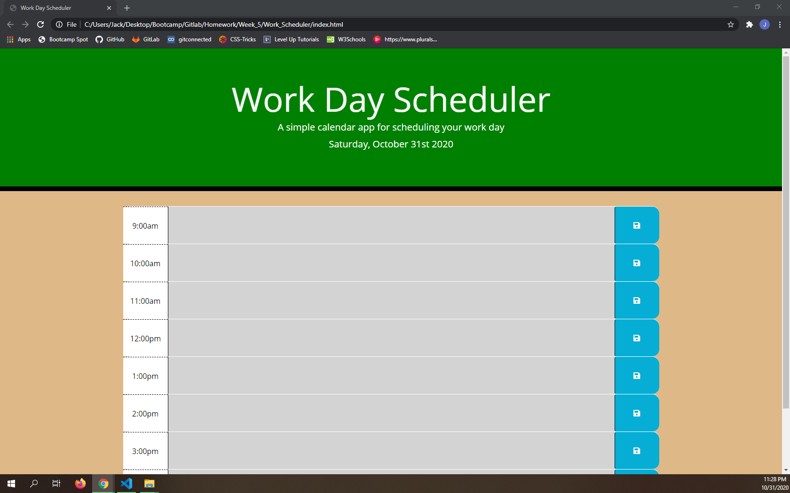

# Work_Scheduler

[Respository Link](https://github.com/jceb30198/Work_Scheduler)

[Project Link](https://jceb30198.github.io/Work_Scheduler/)

## Program Features

- The schedule is from 9 a.m. - 5 p.m. and allows you to plan out the work day.
- The day is up on the top in header.
- Based on the time of the day the time blocks will change color to help coordinate what needs to be done.
- Type something into the empty description space then click the save button.
- When the save button is clicked on a time block then it is saved in local storage for later.

## Images

- The color is not shown on the time blocks because it is past normal schedule.
- Normally it is red during the hour, green when the hour is coming up, and grey when the hour passed.
- On the right you can see the blue save button that saves into local storage.